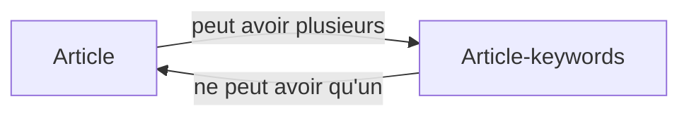

#  Flow chart

```mermaid
graph LR
A[Article] -- peut avoir plusieurs --> B[Article-keywords]
B[Article-keywords] -- ne peut avoir qu'un --> A[Article]
```
Article-keywords reçoit la liaison

FORWARD ENGINEERING

-localhost établit
-next
-next
-summary SQL des requêtes 